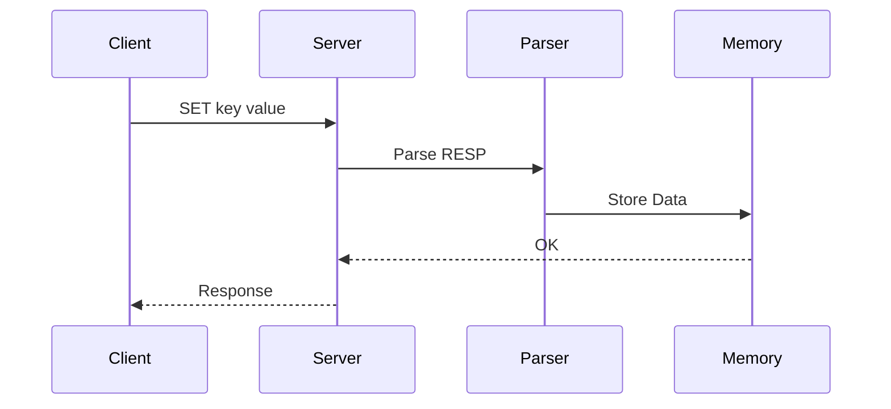

# 🚀 RedisLite — In-Memory Key-Value Store

> A Redis-inspired caching engine built from scratch to explore low-latency data access, protocol design, and backend systems engineering.

---

## 🧠 Architecture

```mermaid
flowchart LR
    A[Client] --> B[TCP Server]
    B --> C[RESP Parser]
    C --> D[Command Engine]
    D --> E[In-Memory Store]
    E --> F[Persistence (RDB)]
```



## 🧩 What I Built

- Custom **TCP server** handling multiple client connections  
- Full **RESP protocol parser** (Redis-compatible)  
- Core commands: `PING`, `ECHO`, `SET`, `GET`  
- **In-memory key-value engine** with O(1) access  
- **TTL-based expiration system**  
- Basic **RDB-style persistence**  

---

## 📊 Performance

| Operation | Complexity |
|----------|-----------|
| GET      | O(1)      |
| SET      | O(1)      |
| EXPIRE   | O(1)      |

> Optimized for low-latency reads using direct memory access.

---

## 📈 Engineering Insights

- RAM-based storage eliminates disk I/O bottlenecks  
- Direct key lookup ensures constant-time performance  
- RESP protocol enables compatibility with `redis-cli`  
- Designed for extensibility (replication, clustering)  

---

## 🧱 Why This Was Challenging

- Designing a **TCP server from scratch**  
- Implementing a **binary-safe protocol (RESP)**  
- Handling **multiple concurrent clients**  
- Managing **memory vs performance trade-offs**  

---

## 🧪 Example Usage

```bash
> PING
PONG

> SET name Aayush
OK

> GET name
"Aayush"
```

## 🚀 Future Improvements

- LRU cache eviction
- Distributed replication
- Pub/Sub messaging
- Benchmarking vs Redis

---

## 👨‍💻 Summary

- This project explores how real-world systems like Redis are built internally — from networking and protocol design to high-performance data handling.
